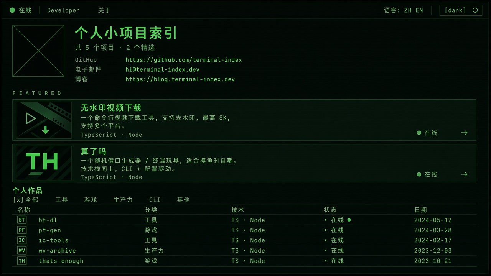
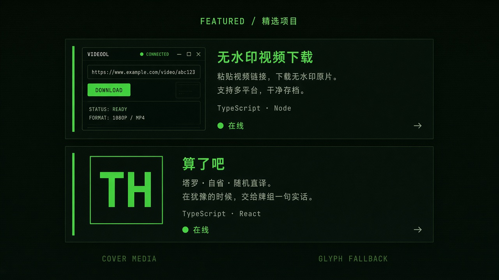
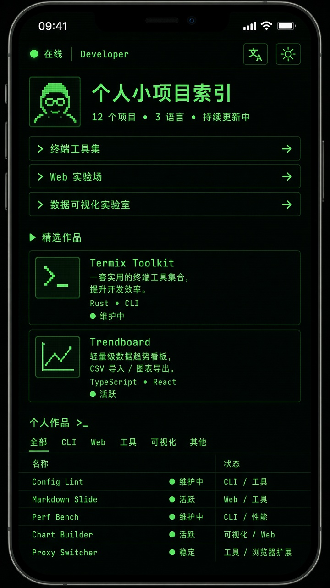

# UI 改进方案 v1 — Curated Terminal Index

> 目标：去掉廉价感与拥挤感，**保留 CRT 终端美学**，不换成通用作品集模板。  
> 范围：首页为主（Hero → 精选 → 目录），详情页跟随后续。  
> 状态：方案待确认（见文末「确认点」）  
> 日期：2026-09-07

---

## 1. 问题与目标

### 现状痛点

| 感受 | 根因 |
| --- | --- |
| 廉价 | 精选与目录同构；无封面证据；字号阶梯塌缩；品牌文案空心 |
| 拥挤 | 区块间距一视同仁；精选行内塞满 glyph/名/tag/状态/描述/箭头 |
| 奇怪 | 两段都是「项目列表」，没有「一主一次」的阅读节奏 |

### 成功标准

1. 首屏 3 秒能说清：这是谁的站、用来干什么。
2. 精选一眼重于目录；去掉精选后，目录仍可用。
3. 区块之间有明显换气；块内可保持终端密度。
4. 仍认得出：墨绿 CRT + JetBrains Mono + 扫描线 + 方角 + 在线状态语法。

### 明确不做

- 不上圆角卡片墙 / 玻璃拟态 / 紫渐变 SaaS 风
- 不引入第二套展示字体（继续 Mono）
- 不把目录改成双列作品卡（继续终端表）
- 不加霓虹 glow、glitch、emoji 图标回潮

---

## 2. 设计原则（本版）

| # | 原则 | 落地含义 |
| --- | --- | --- |
| P1 | **块间疏、块内密** | 区块 `py` / `gap` 加大；表行、链接行保持紧凑 |
| P2 | **一主一次** | 精选 = 策展舞台；目录 = `ls -l` 索引 |
| P3 | **证据优先于装饰** | 有 cover 上屏；无 cover 用大号字形块，不用小徽章糊弄 |
| P4 | **字号阶梯** | 门户主张 / 精选名 ≫ 表单元格 / label |
| P5 | **CRT 语法一致** | 左 inset 光边 hover、`[x]` 筛选、状态色、方角边框 |

---

## 3. 信息架构（首页）

```text
┌─ Header（固定）─────────────────────────────┐
│ ◉ 在线 · Developer · 关于          语言 · 主题 │
└─────────────────────────────────────────────┘

┌─ A. Portal / Hero ──────────────────────────┐  ← 身份层（轻）
│  [头像]                                      │
│  个人小项目索引                               │  ← 补齐 portal.title
│  共 5 个项目 · 2 个精选                       │
│                                              │
│  GitHub     github.com/...                   │
│  电子邮件   ...                              │
│  博客       blog...                          │
└─────────────────────────────────────────────┘
         ↕ 大间距（约 4–5rem）

┌─ B. Featured（主舞台）──────────────────────┐  ← 视觉主层（重）
│  FEATURED                                    │
│  ┌────────────────────────────────────────┐  │
│  │ [封面或 64–80px 字形]  无水印视频下载   │  │
│  │                        一句话价值主张    │  │
│  │                        TypeScript · Node │  │
│  │                        ◉ 在线        →  │  │
│  └────────────────────────────────────────┘  │
│  ┌────────────────────────────────────────┐  │
│  │ ... 算了吗 ...                          │  │
│  └────────────────────────────────────────┘  │
└─────────────────────────────────────────────┘
         ↕ 大间距（约 4–5rem）

┌─ C. Catalog（索引）─────────────────────────┐  ← 工具层（密）
│  个人作品                    [x]全部 工具 …   │
│  名称 | 分类 | 技术 | 状态 | 日期            │
│  WV  无水印…  工具  TS·Node  在线  2025-…   │
│  …                                           │
└─────────────────────────────────────────────┘

┌─ Footer ────────────────────────────────────┐
└─────────────────────────────────────────────┘
```

**阅读节奏**：身份 → 停顿 → 作品重点 → 停顿 → 全量索引。

---

## 4. 分区方案明细

### 4.1 Header

| 项 | 方案 |
| --- | --- |
| 布局 | 保持现状：在线 · 站名 · 关于 | 语言 · 主题 |
| 小改 | `sm` 以下显示短站名或域名缩写（避免只剩「◉ 在线」） |
| 触控 | 主题/语言热区高度 ≥ 40–44px（视觉可仍紧凑） |

### 4.2 Portal / Hero

| 项 | 现状 | 方案 |
| --- | --- | --- |
| 标题 | 中文 `portal.title` 为空 | 填：「个人小项目索引」（EN 可保留 Portal 或改为 Personal tools index） |
| 统计 | 已有文案 | 保留在标题下，`text-xs` muted |
| 头像 | 72px | 保持；与标题纵向对齐，下方再接链接表 |
| 链接行 | label + link | 保持终端通讯录；行距可略增至 `space-y-3.5` |
| 底边距 | `pb-4` | 改为更大下边距，与精选拉开 |

**不放**：统计条、多 CTA、徽章堆叠。

### 4.3 Featured — 升格核心

#### 结构（每项）

```text
┌─ terminal-card（surface 底）─────────────────────────┐
│  ┌──────────┐   名称（text-base / ~1.125rem，semibold）│
│  │  cover   │   描述 2 行（text-sm，muted）            │
│  │  或      │   tech 一行（dim，· 分隔，最多 3）       │
│  │  大字形  │   状态（右下或描述旁）          →        │
│  │  64–80px │                                          │
│  └──────────┘                                          │
└────────────────────────────────────────────────────────┘
```

#### 规则

| 规则 | 说明 |
| --- | --- |
| 封面 | 有 `cover` / OG 时左侧固定宽媒体（约 112–140px 宽，高随比例，方角、贴齐卡片内边，无圆角阴影） |
| 无封面 | （已确认去掉字形）一律用 OG 回退图 `/og/projects/{slug}.png` |
| 去噪 | 去掉行内 category tag（分类交给目录）；不显示「项目 01」 |
| 间距 | 卡片之间 `gap-3`；卡片内边距 `p-4`；区块标题与首卡 `mb-4` |
| Hover | 边框 → accent + 左侧 2px inset；**禁止**整卡 opacity |
| 区块标题 | `FEATURED` /「精选项目」用 `terminal-label`，字距保持 |

#### 与目录的差异（必须肉眼可见）

| | 精选 | 目录 |
| --- | --- | --- |
| 高度 | 约 88–112px / 卡 | 约 44–52px / 行 |
| 媒体 | 大字形或封面 | 24–32px 小字形 |
| 文案 | 名 + 2 行描述 + tech | 名 + 分类 + tech 摘要 + 状态 + 日期 |
| 背景 | `crt-surface` 卡片 | 透明表行 |

### 4.4 Catalog

| 项 | 方案 |
| --- | --- |
| 形态 | **保持终端表**（方案 A），不大改列结构 |
| 筛选 | 保留 `[x]`；按钮增加垂直 padding，热区更好点 |
| 字号 | 表内维持 `0.8125rem`；区块标题 `text-lg` |
| 与精选间距 | 上一区块底部 → 本区块顶部 ≥ 4rem |
| Hover | 行 glow + inset（已有则保持） |

可选微调（本版可做可不做，标为 B）：

- 小屏改为「上行：名+状态 / 下行：分类」两行结构，避免碎片 wrap

### 4.5 间距与字号 Token（建议）

| Token | 值 | 用途 |
| --- | --- | --- |
| `--section-gap` | `4.5rem`（72px）/ `sm: 5rem` | Hero↔精选↔目录 |
| `--featured-pad` | `1rem` | 精选卡内边距 |
| `--featured-media` | `4.5rem`–`5rem` | 无封面字形；有封面宽约 `7–9rem` |
| 门户标题 | `1.125–1.25rem` | Hero h1/h2 |
| 精选名 | `1.0625–1.125rem` | 高于表内名 |
| 表单元格 | `0.8125rem` | 保持 |
| Label | `0.6875rem` + tracking | 保持 |

### 4.6 运动（克制，2–3 个）

1. 精选挂载一次 stagger（fade + 4px translate），`prefers-reduced-motion` 关闭  
2. 卡/行 hover 150–200ms（已有方向）  
3. 主题切换保持现有 bg/color transition  

### 4.7 文案（本版一并改）

| Key | 中文建议 | 英文建议 |
| --- | --- | --- |
| `portal.title` | 个人小项目索引 | Personal tools index |
| （可选）项目 description | 偏利益点一句，少「XX，可以XX」同义反复 | 与中文信息量对齐 |

品牌名 `Developer` 是否改域名感（如 juhaozero / DEV.INDEX）→ **品牌决策，本版不强制**，列入确认点。

### 4.8 详情页（本版仅原则，下期实现）

- 首屏：封面或大字形 + 名 + 一句 + 主按钮「打开项目」权重明显高于次链  
- tech / lifecycle 保留元信息区  
- 与首页精选卡视觉同族，避免详情突然变「另一套站」

---

## 5. 响应式

| 断点 | 行为 |
| --- | --- |
| ≥1024 | 精选：左媒体 + 右文案横排；目录全列 |
| 768–1023 | 同上，封面略收窄；目录隐藏 DATE 列（现状） |
| &lt;640 | 精选可改为媒体在上、文案在下，或保持横排但媒体 56px；目录 TECH/CATEGORY 按现有 hidden；顶栏显示短品牌 |

---

## 6. 分阶段落地

### Phase A — 呼吸 + 文案 + 精选升格（本方案核心）

1. 补 `portal.title`  
2. 加大区块间距（Hero / Featured / Catalog）  
3. 精选卡：更大媒体区、2 行描述、tech 行、去 category tag、加大内边距  
4. 有 cover 则上屏（至少精选两项）  

### Phase B — 触控与顶栏

1. 小屏站名  
2. 筛选/主题热区  

### Phase C — 详情与资产

1. 详情封面 + 主 CTA  
2. 项目文案润色  

---

## 7. 对照：改前 vs 改后（首页）

| | 改前 | 改后 |
| --- | --- | --- |
| Hero 标题 | 空 | 有主张一句 |
| 区块间距 | ~2–2.5rem 体感 | ~4.5–5rem |
| 精选高度 | ~56–64px 细条 | ~88–112px 舞台卡 |
| 精选媒体 | 32px glyph | 64–80px 或封面 |
| 精选信息 | 名+tag+状态+1行夹断 | 名+2行+tech+状态 |
| 目录 | 终端表 | 终端表（基本不动） |
| 主题 | CRT | CRT（不变） |

---

## 8. 预览图

文件在 [`docs/previews/`](./previews/)：

| 图 | 文件 | 看什么 |
| --- | --- | --- |
| 桌面首页 | [`ui-proposal-desktop-home.png`](./previews/ui-proposal-desktop-home.png) | 三层节奏、块间留白、精选 vs 表 |
| 精选特写 | [`ui-proposal-featured-cards.png`](./previews/ui-proposal-featured-cards.png) | 封面卡 vs 字形卡结构 |
| 移动首页 | [`ui-proposal-mobile-home.png`](./previews/ui-proposal-mobile-home.png) | 小屏呼吸与精选高度 |

> 预览为方向示意（AI 生成），实现以本文 Token / 结构为准；色值与真实 CSS 变量可能略有偏差。







确认微调时，请直接对着预览图标注意见（见下节）。

---

## 9. 确认记录（2026-09-07）

| # | 项 | 决定 |
| --- | --- | --- |
| 1 | 精选媒体 | **A** 优先真实 cover；后改为 **CRT 风格站内封面** `/covers/projects/{slug}.png`（与社媒 OG 分离） |
| 2 | 精选布局 | **A** 左媒体 + 右文案 |
| 3 | 区块间距 | **A** 约 72px（`4.5rem`） |
| 4 | 门户标题 | **先不填**（`portal.title` 保持空） |
| 5 | 站名 | **保持 Developer** |
| 6 | 目录 | **顺带做移动端两行**（上行名+状态 / 下行分类） |
| + | 字形 | **去掉**（精选 / 目录 / 详情均不再使用 `projectGlyph`） |

Phase A 按上表落地。

---

## 10. CRT Boot（首页开机，2026-09-07 grilling）

| # | 决定 |
| --- | --- |
| 形态 | 点亮（~1.6s）+ 打字 |
| 频率 | **每次进入首页都播**（不再用 sessionStorage） |
| 跳过 | 点击 / Esc / Enter / Space；前 400ms 防误触 |
| 遮罩 | 全屏 + **CRT POWER ON** 状态框 + 扫描展开；`head` inline 防闪 |
| 主题 | 仅暗色播点亮；亮色只打字 |
| 再访 | 每次回首页都重新点亮 + 打字（`prefers-reduced-motion` 除外） |
| 视觉 | 干净磷光，无 glitch |
| 详情 | 不加开机，保留 `cat` 命令行 |
| 项目区 | 门户后：`cat ~/featured.list` → 精选 stagger；再 `ls -l ~/projects` → 目录 stagger |

实现：`CrtBootController` + intro 事件串联 `HeroPortal` / `FeaturedProjects` / `ProjectCatalog`。
